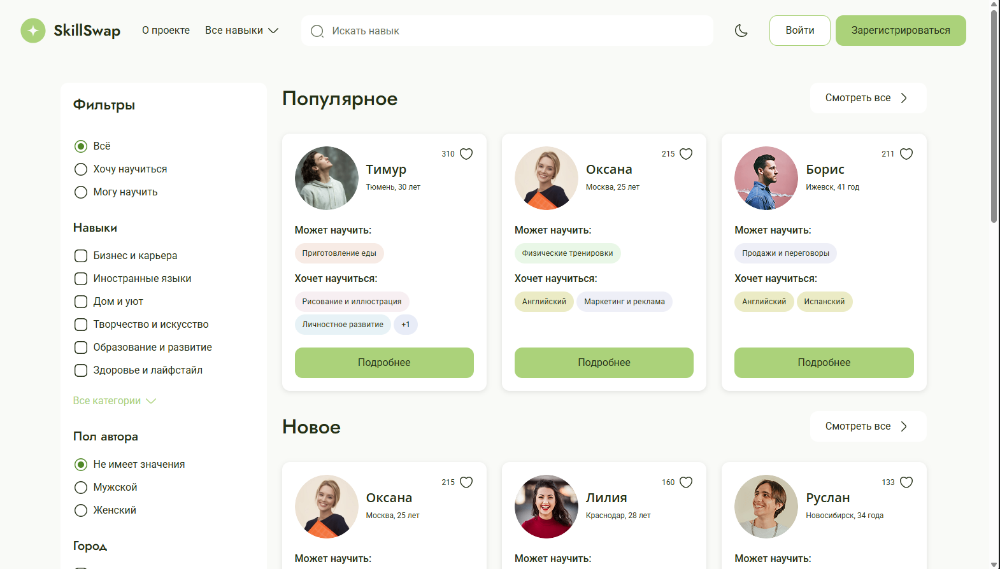
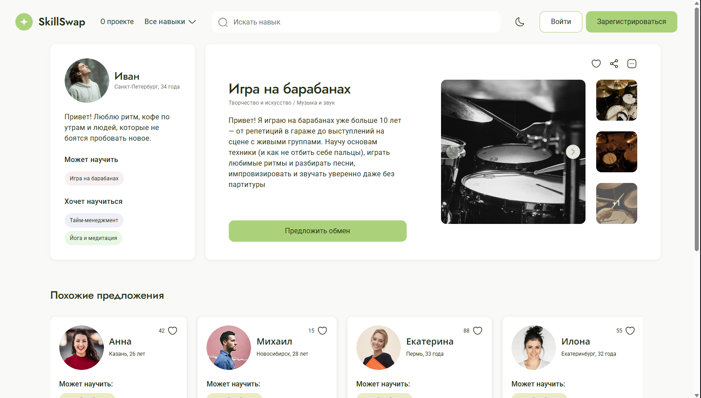
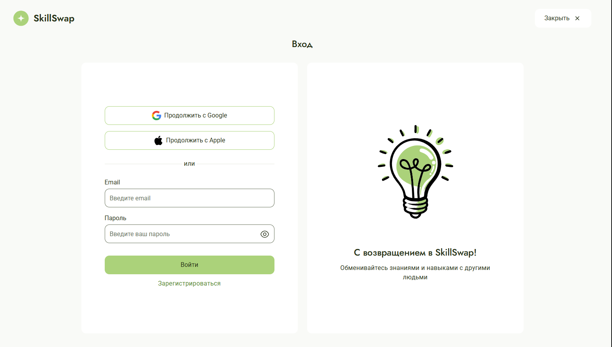

# 🎓 Платформа обмена навыками SkillSwap

## 👀 Взгляд на проект
<div align="center">
    
    
    
</div>

## О проекте
SkillSwap - это проект командной разработки. Он предназначен для обмена навыками между людьми, это можно назвать некой фриланс площадкой.

## 💻 Используемые технологии

- **React 19** + **TypeScript**
- **Redux Toolkit** + **React-Redux** — управление состоянием
- **SCSS** — стили
- **ESLint 9** + **Prettier** + **Stylelint** — качество кода
- **Jest 30** + **React Testing Library** — unit-тесты
- **Husky** + **commitlint** — git-хуки, Conventional Commits
- **GitHub Actions** — CI (lint + тесты на каждый PR/push)

## Структура проекта

```
src/
├── api/          # Методы работы с мок-данными (axios/fetch)
├── app/          # Инициализация, провайдеры, глобальные стили
├── entities/     # Модели домена: Skill, User, Request
├── features/
│   ├── auth/         # Авторизация
│   ├── skills/       # Навыки
│   ├── favorites/    # Избранное
│   └── requests/     # Заявки на обмен
├── widgets/      # Переиспользуемые блоки: SkillCard, FiltersBar
└── pages/        # Страницы: Home, Profile, Skill, Favorites
```

## ▶️ Установка и запуск 
**1. Клонирование репозитория**
```bash
git clone git@github.com:nikita-pugachev/SkillSwap.git
```
**2. Запуск**
* Открыть проект в VS code или другом IDE.
* Установить зависимости 'npm install'
* Запустить проект с помощью комадны для терминала 'npm run dev'

## ✉️ Контакты автора
[](https://t.me/RUSSS1NG)
[](mailto:RUSSSSing@yandex.ru)